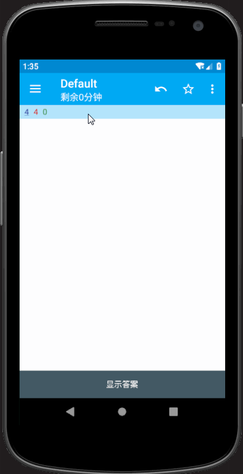
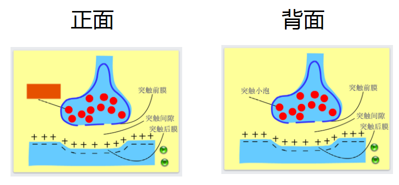
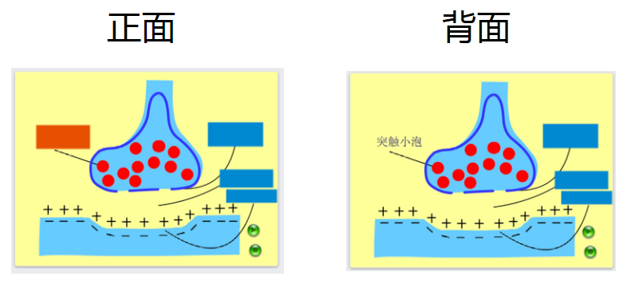

# Anki Doodle

## Introduction

**Anki Doodle**(([Download](https://github.com/mmjang/Ankillusion/releases/download/v1.1.0/Anki.Doodle.v1.1.0.apk))) helps you create image occlusion flashcards.

Image occlusion:

Flashcards review：

This app must be used with Ankidroid([Download](https://play.google.com/store/apps/details?id=com.ichi2.anki)), the android version of flashcard software Anki. Before use **Anki Doodle**, please make sure you have Ankidroid installed.

## Features

Can handle images from Gallery, Camera and Sharing from other apps;

Support image rotation and cropping;

Support moving, scaling, rotation and deletion of occlusion area;

Support 3 card-creation modes：

1. **Hide All - Reveal All**；

2. **Hide One - Reveal One**；

3. **Hide All - Reveal One**:

## Common Questions

### Why can't I sync the images to the desktop version of Anki?

Due to some implementation details of Ankidroid, when adding cards via its api, it doesn't check for
media file links in them, which makes the images files not included in the media database and
can't be synced.

To solve the problem, before syncing your decks, open the menu at the left right corner of
Ankidroid and select "Check Media". This will make the image files added by Anki Doodle syncable.
